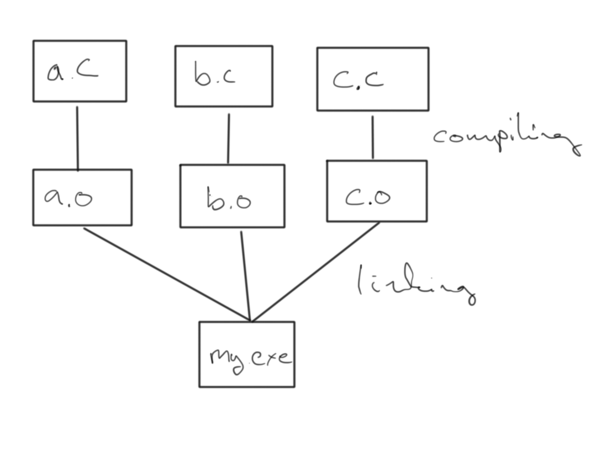

# Build automation

Frequently your computational goal is a product of several processing steps that needs to be executed sequential. Often the same set of steps needs to be executed in similar projects as well. Also sometimes you want to tweek some of the "in-the-middle" processing steps. Would it not be sweet if you did not have to reprocess all your steps up to that point? Here build automation can help you.




## GNU Make

GNU Make is a build automation system that has been an integral part of unix since 1976. It was written with building executables from source code in mind, but can be used for other purposes as well.

GNU Make execution interprets a programable script: A make file, typically named "Makefile"
The make file contains rules, following a scheme,
```
product: dependency1 [dependecy2 ...]
    action
```
Note that the action has to be breceeded by a tab character.
An example rule:
```
my.mzdata: my.raw
    msconvert -o my.mzdata -i my.raw
```
These can be generalized using wildcard charecters,
```
all: my.mzdata

%.mzdata: %.raw
    msconvert -o $@ -i $<
```

An example [Makefile](martin/Makefile).

## Modern automation

While GNU Make is sufficient for handling data from most projects, there are resons to look on more modern build automation tools, such as snakemake and nextflow if your project:

* Includes advanced dependency structures
* Should be parallelized over a cluster
* You want to containerize your code with Docker or Singularity

### Nextflow

Built around the concepts of Processeses and channels. A process takes one or more channels as input and operates on the data from the chanels, and forwards data on another channel.

An example:
```
x = Channel.from( 'Alice', 'Bob', 'Charlie')

process helloPerson {
    input:
    val x

    exec:
    println "Hello $x"
}
```

Another example [nextflow-script](nextflow/example.nf).

There is a good tutorial for nextflow available [here](https://www.seqera.io/training/)

#### Logging and tracing of nextflow execution

You can track your previous runs with the command `nextflow log`. You will get more specific information on which output directories that were made by specifying a specific run, e.g. `nextflow log jovial_shockley`


### nf-core

As we tend to do the same operations as everyone else in bioinformatics, there is a need to disemenate well functioning workflows.

There are repositories of nextflow scripts at [nf-core](https://nf-co.re/)

Another set of curtated piplines are stored at [awsome-nextflow](https://github.com/nextflow-io/awesome-nextflow), curated by nextflow rather than nf-core.

For snakemake a similar repository can be found at [snakemake-workflows](https://github.com/snakemake-workflows).

A common repository can be found at [workflowhub](https://workflowhub.eu/)

