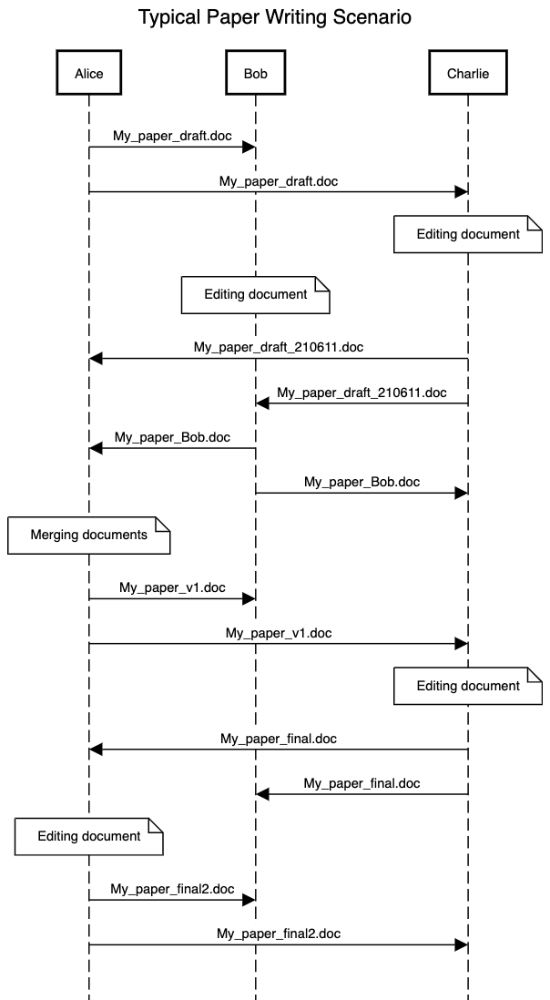

# Version control and Code repositories

Modern open-source development is dependent on code repositories, to 
diseminate and get feedback on software and code. Such systems are dependent on version control systems.

Typical examples: 

* [Github](github.com)
* [Bitbucket](bitbucket.com)

## Version Control

A motivating example of "manual" version control.

### Version Control Systems

A method to tracking and managing changes to text files. The system makes common version of a set of files. 

Version control allows users to:
* Access the same set of files.
* Access older versions of the files (like an undo button).
* Track changes made to the files
* Handle version conflicts
* Store backed-up files

Can be used:
* by teams as well as individuals.
* for source code or other text files

### Git

`git commit`: adding your edits in files to the local repository
`git diff`: Checking differences between files and local repository
`git status`: Tells which files that are edited
`git add`: Track a file.
`git checkout`: Retrieve a file from the local repository.

