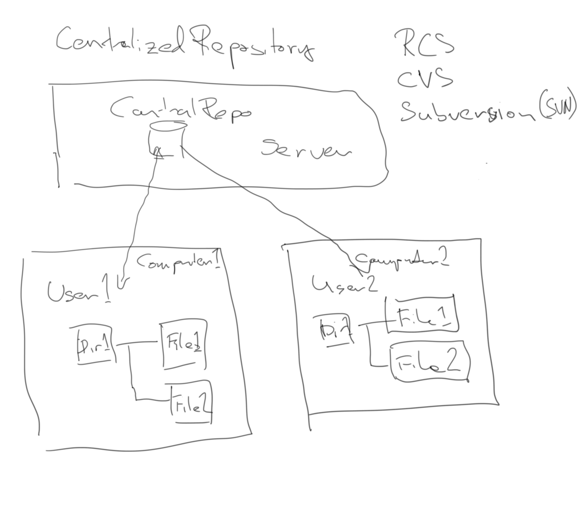
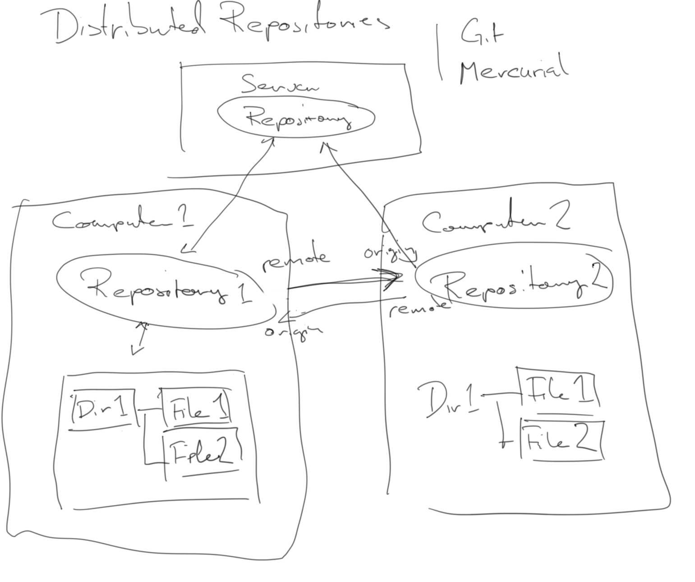

# Version control and Code repositories

Modern open-source development is dependent on code repositories, to 
diseminate and get feedback on software and code. Such systems are dependent on version control systems.

Typical examples: 

* [Github](github.com)
* [Bitbucket](bitbucket.com)

## Version Control

A motivating example of "manual" version control.

### Version Control Systems

A method to tracking and managing changes to text files. The system makes common version of a set of files. 

Version control allows users to:
* Access the same set of files.
* Access older versions of the files (like an undo button).
* Track changes made to the files
* Handle version conflicts
* Store backed-up files

Can be used:
* by teams as well as individuals.
* for source code or other text files

## Centralized vs. Distributed Repositories

Older systems like RCS, CVS and subversion are centralized.  

Git and mercury are instead distributed version control systems.

### Git

* `git commit`: adding your edits in files to the local repository
* `git diff`: Checking differences between files and local repository
* `git status`: Tells which files that are edited
* `git add`: Track a file.
* `git checkout`: Retrieve a file from the local repository.
* `git push`: Push the edits from local repository into the remote repository. 
* `git pull`: Retrieve all commits from the remote back to the local repository.
* `git init`: Creates a new local repository.
* `git clone`: Copy a remote repository into your local repository.

## What should go under version control

Should be under version control:
* Source code
* Text files

Should **not** be under version control:
* Files produced from files under version control
* Binaries

Maybe:
* Data

## IDE

Most integrated development environments (IDEs) have support for git.

## Pull request

(Not part of git, but bitbucket/github)  

If you want to edit someone elses repository on github/bitbucket, you normaly clone the repository
make your edits, push them to your cloned directory. You then set up a *pull request*, that will be sent to the owner of the repository, that allows the owner to incorporate the edits (or ignore them).

## How to move an offline repository

This stack overflow thread gives a good description of how to migrate a repository from [an offline computer](https://stackoverflow.com/questions/28027190/copy-git-repository-to-offline-machine-and-pushing-pulling-via-memory-stick). It comes down to copy the full .git subdirectory that sits in the root of each local git repository.
